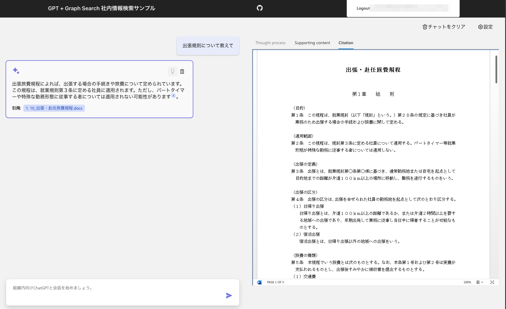
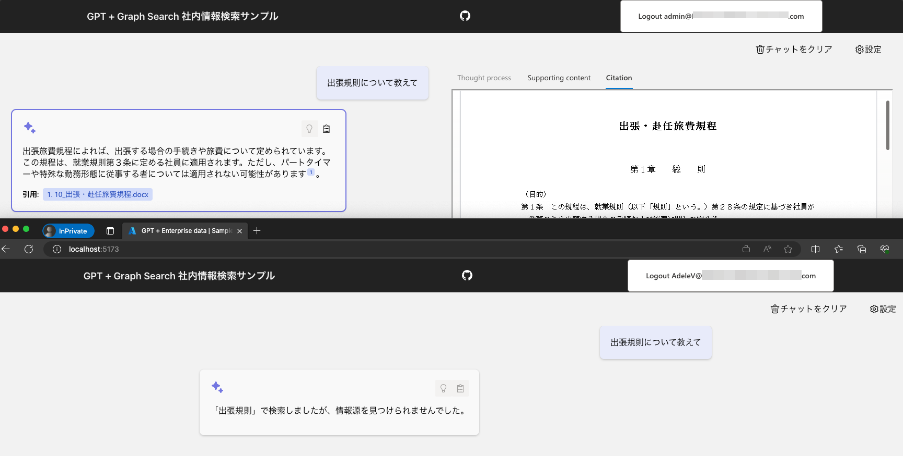
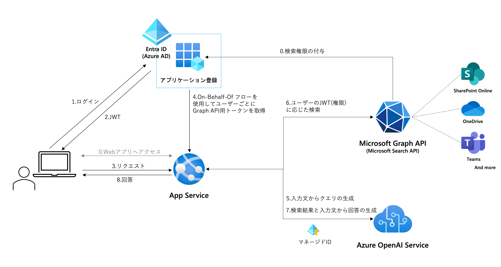
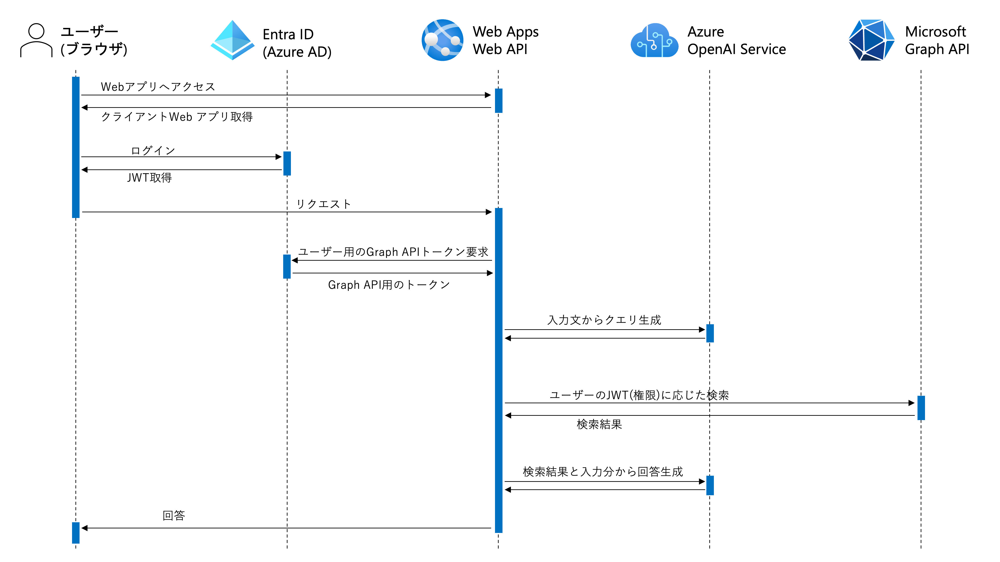

[English](./README_en.md)

# Microsoft Search API RAG サンプルアプリ



このサンプルは[Azure-Samples/azure-search-openai-demo](https://github.com/Azure-Samples/azure-search-openai-demo)をベースに開発されています。

> **Note**
> Note:このサンプルで使用されているMicrosoft Graph SDK for Pythonは現在[プレビュー段階](https://learn.microsoft.com/ja-jp/graph/sdks/sdks-overview#supported-languages)です。


## 概要
<!--ここにスクショを入れる-->

### 機能
- Microsoft 365内のドキュメントやサイト、Teamsの投稿などを基にしたLLMによるチャット形式の内部ナレッジ検索
- Microsoft 365でも使用されるMicrosoft Search APIを使用したシンプルかつ高精度なRAGアーキテクチャ
- [On-Behalf-Of フロー](https://learn.microsoft.com/ja-jp/entra/identity-platform/v2-oauth2-on-behalf-of-flow)を使用した元データに付与されたユーザーごとの権限に応じた検索


### 技術概要
アーキテクチャ


シーケンス


###　現時点での制限
- Citationタブでの参考文書の参照は、ブラウザにMicrosoft Edgeのみで動作します。その他のブラウザはiframeによる認証情報の伝播の制限により動作しません。 (https://github.com/07JP27/azureopenai-internal-microsoft-search/issues/12)
- 現在はStreamingモードを実装していません。(https://github.com/07JP27/azureopenai-internal-microsoft-search/issues/9)

## セットアップ方法
### 前提条件
- このリポジトリをクローンまたはダウンロード
- Azure OpenAI ServiceまたはOpenAIの準備
    - Azure OpenAI Service：GPT-35-turboまたはGPT-4のデプロイ
    - OpenAI：APIキーを取得
- ローカル実行を行う場合は以下の環境がローカルマシンに準備されていること
    - Python
    - Node.js
    - Azure CLI

### 1.アプリケーション登録
1. [Azure Portal](https://portal.azure.com/)にログインします。
1. [Microsoft Entra ID](https://portal.azure.com/#view/Microsoft_AAD_IAM/ActiveDirectoryMenuBlade/~/Overview) > アプリの登録 の順に選択していき、アプリ登録一覧画面で「新規登録」を選択します。
1. 「名前」を入力します。（例：ChatGPT-GraphSearch）
1. 「サポートされているアカウントの種類」で「この組織ディレクトリのみに含まれるアカウント」を選択
1. 「リダイレクトURI」でプラットフォームを「シングルページアプリケーション(SPA)」、URIを「http://localhost:8000/redirect」に設定します。
1. 「登録」をクリックします。
1. 登録されたアプリ登録に移動し、ブレードメニューの「APIのアクセス許可」にアクセスします。
1. 「アクセス許可の追加」から「Microsoft Graph」>「委任されたアクセス許可」の順に選択していき「Files.Read.All」と「Sites.Read.All」にチェックを入れて「アクセス許可の追加」を選択します。
1. アクセス許可一覧に選択したアクセス許可がリストアップされていることを確認します。
1. ブレードメニューから「APIの公開」を選択して「アプリケーション ID の URI」の「追加」をクリックします。
1. 表示される「api://{UUID}」の状態のまま「保存」を選択します。
1. 同ページの「Scopeの追加」を選択します。
1. スコープ名に「access_as_user」と入力してその直下に「api://{UUID}/access_as_user」と表示されるようにするします。
1. 同意できる対象で「管理者とユーザー」を選択します。
1. そのほかの表示名や説明は任意の文章（＝初回ログイン時に委任を求める画面で表示される内容）を入力して「スコープの追加」を選択します。
1. ブレードメニューから「証明書とシークレット」を選択します。「新しいクライアントシークレット」を選択してクライアントシークレットを任意の説明と期間で追加します。
1. 作成されたシークレットの「値」をメモ帳などにコピーします。**シークレットの値は作成直後しか表示されません。メモせずに画面遷移をすると２度と表示できないのでご注意ください。**
1. ブレードメニューから「概要」を選択して表示される次の情報をメモ帳などにコピーします。
    - ディレクトリ(テナント)ID
    - アプリケーション(クライアント)ID

### 2. プロンプト調整
用途に応じて以下のファイルの`system_message_chat_conversation`、`query_prompt_template`、`query_prompt_few_shots`に記述されているプロンプトを調整します。
https://github.com/07JP27/azureopenai-internal-microsoft-search/blob/52053b6c672a32899b5361ae3510dbe0c40693c6/src/backend/approaches/chatreadretrieveread.py#L29

### 3.ローカル実行
1. 対象のAzure OpneAI Serviceのアクセス制御でローカル実行ユーザーにRBAC「Cognitive Services OpenAI User」ロールを付与します。**すでに共同作成者がついている場合でも必ず別途付与してください**
1. ターミナルで`az login`を実行してAzure OpenAI ServiceのリソースのRBACに登録したアカウントでAzureにログインします。
1. ターミナルなどでクローンしたファイルの「src/backend」に移動して「pip install -r requirements.txt」を実行します。パッケージのインストールが完了するまでしばらく待ちます。
1. 別ターミナルなどを開きクローンしたファイルの「src/frontend」に移動して「npm install」を実行します。パッケージのインストールが完了するまでしばらく待ちます。
1. 「src/backend」内に.envファイルを作成して[.env-sample](./src/backend/.env-sample)に記載されている内容をコピーします。 `AZURE_CLIENT_APP_ID` と `AZURE_SERVER_APP_ID` は一致している必要があります。
1. それぞれの環境変数にメモした情報などを入力します。
1. 「src/backend」を開いているターミナルで「quart run」を実行します。
1. 「src/frontend」を開いているターミナルで「npm run dev」を実行します。
1. ブラウザで「http://localhost:5173/」にアクセスします。
1. 画面右上の「Login」ボタンをクリックして、アプリ登録を行ったディレクトリのユーザーアカウントでログインします。ログインに成功したら「Login」と表示されていた部分にユーザーのUPNが表示されます。
1. 入力エリアに質問を入力してチャットを開始します。

### 4.Azureへのデプロイ
#### Azure リソースの作成
以下のコマンドを実行して、バックエンドAPIをデプロイするApp Serviceを作成します。
```sh
export RG_NAME="resource-group-name"
export ASP_NAME="app-service-plan-name"
export APP_NAME="web-app-name"

# リソースグループの作成
az group create --name $RG_NAME

# App Service Planの作成
az appservice plan create --name $ASP_NAME --resource-group $RG_NAME --sku B1 --is-linux

# App Serviceの作成
az webapp create --name $APP_NAME --resource-group $RG_NAME --plan $ASP_NAME --runtime "PYTHON|3.11" 
```

####  App Serviceの初期設定
以下のコマンドを実行して、App Serviceの初期設定を行います。
`AZURE_CLIENT_APP_ID`、`AZURE_SERVER_APP_ID`、`AZURE_SERVER_APP_SECRET`、`AZURE_TENANT_ID`は前の手順でメモした情報を指定してください。
```sh
# スタートアップコマンドの設定
az webapp config set --resource-group $RG_NAME --name $APP_NAME --startup-file "python main.py"

# 環境変数の設定
az webapp config appsettings set --resource-group $RG_NAME --name $APP_NAME --settings \
  SCM_DO_BUILD_DURING_DEPLOYMENT=true \
  AZURE_OPENAI_CHATGPT_MODEL="gpt-4o" \
  AZURE_OPENAI_SERVICE="<your AOAI service name>" \
  AZURE_OPENAI_CHATGPT_DEPLOYMENT="<your AOAI deployment name>" \
  AZURE_USE_AUTHENTICATION="true" \
  AZURE_SERVER_APP_ID="<your application id copied from app registration on Azure portal>" \
  AZURE_SERVER_APP_SECRET="<your secret copied from app registration on Azure portal>" \
  AZURE_CLIENT_APP_ID="<your application id copied from app registration on Azure portal>" \
  AZURE_TENANT_ID="<your tenant id copied from app registration on Azure portal>" \
  TOKEN_CACHE_PATH=None
```

App ServiceがAzure OpenAI Serviceにアクセスできるようにするために、以下のコマンドを実行して、App ServiceのマネージドIDを有効化し、Azure OpenAI Serviceのアクセス権限を付与します。
* `<app-service-managed-id>`: 上記で有効化したマネージドIDの `principalId` 
* `<subscription-id>`: AzureサブスクリプションID
* `<cognitive-services-name>`: 作成したAzure OpenAI Serviceの名前
```sh
# App ServiceのマネージドIDを有効化する
az webapp identity assign --resource-group $RG_NAME --name $APP_NAME

# App ServiceのマネージドIDが有効化したことを確認する
az webapp identity show --resource-group $RG_NAME --name $APP_NAME

# App ServiceのマネージドIDに対して、Azure OpenAI Serviceのアクセス権限を付与する
az role assignment create --role "Cognitive Services OpenAI User" --assignee <app-service-managed-id> --scope /subscriptions/<subscription-id>/resourceGroups/$RG_NAME/providers/Microsoft.CognitiveServices/accounts/<cognitive-services-name>

# 外部Gitリポジトリからのデプロイを有効化する
az webapp deployment source config --resource-group $RG_NAME --name $APP_NAME --manual-integration --repo-url https://github.com/marumaru1019/POC-GraphSearch-RAG --branch main
```


#### Entra ID へのアプリケーション登録
App ServiceがMicrosoft Entra IDを介してGraph APIにアクセスできるようにするために、以下の手順でアプリケーション登録を行います。

ローカル実行の際に作成したEntra ID のアプリケーション登録にApp ServiceのURLを使ったredirect URI `"https://$APP_NAME.azurewebsites.net/redirect"` を追加します。（ `http://localhost:8000/redirect` が既にある）`$APP_NAME` はApp Serviceの名前を指定してください。

#### Azure App Serviceへのデプロイ
App Serviceで静的コンテンツをホストするために、以下の手順でフロントエンドのビルドを行います。二回目以降のデプロイでは、フロントエンドに変更を加えていない場合はこの手順はスキップしてください。
```sh
$ cd frontend
$ npm run build
```

初期設定で指定したリポジトリのブランチにコードをプッシュして、同期コマンドを実行することでApp Serviceにデプロイします。
```sh
# ローカルの差分をGitリポジトリにプッシュする
$ git add .
$ git commit -m "Deploy to Azure"
$ git push

# App Serviceにデプロイブランチのコードを同期させる
az webapp deployment source sync --resource-group $RG_NAME --name $APP_NAME
```

